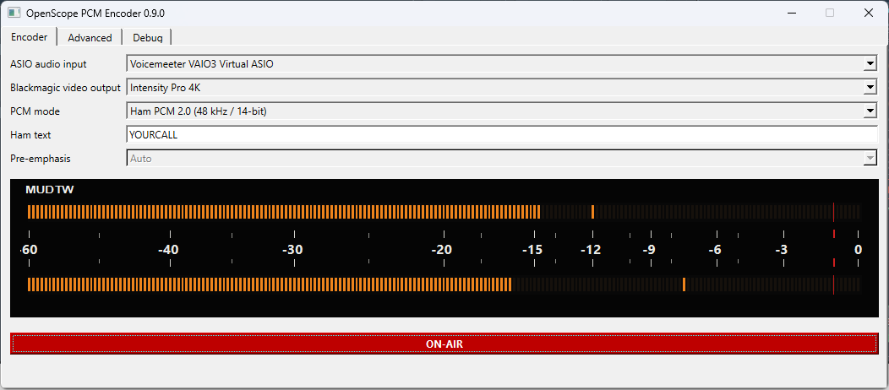
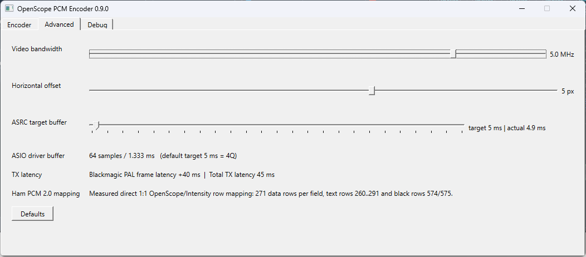
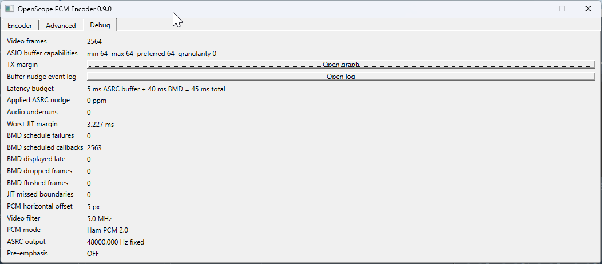
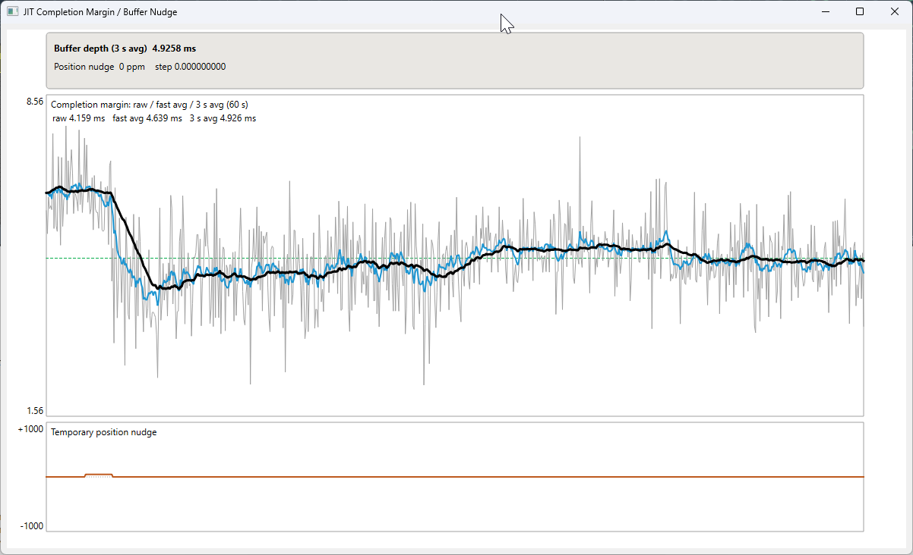
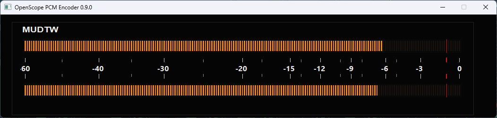

# OpenScope PCM Encoder

Standalone Windows PAL PCM-video encoder for use with OpenScope and compatible PCM-F1 / EIAJ-style decoders.

Current source version: **0.9.0**.

The application captures stereo audio through **ASIO**, performs low-latency asynchronous sample-rate conversion to 44.1 kHz, encodes PCM audio into a PAL 625/50 video raster, and outputs it through a **Blackmagic DeckLink** device. It includes live PPM meters and controls for PCM mode, pre-emphasis, pulse shaping, video placement and low-latency buffer behaviour.

## Screenshots

### Main window


Main encoder view showing ASIO input selection, DeckLink output selection, PCM mode selection, front-panel style meters and ON-AIR status.

### Advanced controls


Video shaping and timing-related controls including video bandwidth, horizontal offset and the ASRC target buffer.

### Debug status


Status overview with ASIO driver capabilities, TX margin, underrun counters, latency budget and active encoder settings.

### JIT / buffer control graph


Live view of completion margin, filtered buffer depth and temporary position nudges used by the low-latency ASRC/JIT control loop.

### Fullscreen MUDTW meter


Fullscreen MUDTW front-panel meter with segmented dual-channel level display.

## Main features

- PAL 625/50, 720x576 UYVY DeckLink output
- 16-bit PCM-F1 and 14-bit EIAJ-style PCM modes
- EIAJ control-H generation
- 50/15 us pre-emphasis control
- ASIO audio input
- low-latency ASRC from the native ASIO rate to 44.1 kHz
- adaptive buffer / timing control referenced to the ASIO driver quantum
- configurable Sony/MUD vertical PCM placement
- horizontal offset and pulse-shaping controls
- RTW/MUDTW-style stereo PPM meters with peak hold
- Qt 6 Windows GUI

## Requirements

- Windows 10 or Windows 11, x64
- Visual Studio with the MSVC C++ toolchain
- CMake 3.25 or newer
- Ninja (recommended)
- vcpkg with Qt 6 `qtbase`, or another Qt 6 installation discoverable by CMake
- Steinberg ASIO SDK
- Blackmagic Desktop Video plus the Blackmagic DeckLink SDK
- a supported Blackmagic DeckLink / Intensity output device

The ASIO SDK and DeckLink SDK are **not included in this repository**. Obtain them from their respective vendors and comply with their licence terms.

## Dependency setup

`vcpkg.json` declares the Qt dependency. If vcpkg is installed in a standard location, the project tries to find its toolchain automatically. Otherwise set `CMAKE_TOOLCHAIN_FILE` explicitly.

Set the SDK roots either as environment variables:

```text
ASIO_SDK_ROOT=C:\path\to\asiosdk
DECKLINK_SDK_ROOT=C:\path\to\Blackmagic DeckLink SDK 16.0
```

or pass them to CMake with `-DASIO_SDK_ROOT=...` and `-DDECKLINK_SDK_ROOT=...`.

The ASIO root must contain at least:

```text
common/asio.cpp
host/asiodrivers.cpp
host/pc/asiolist.cpp
```

The DeckLink SDK root must contain:

```text
Win/include/DeckLinkAPI.idl
```

## Build

From a Visual Studio developer command prompt:

```bat
cmake -S . -B out\build\release -G Ninja -DCMAKE_BUILD_TYPE=Release
cmake --build out\build\release
```

Or use `deploy.bat` as a starting point for a local Windows deployment build.

After a successful build, CMake runs `windeployqt` when it can find it and also copies the Qt Windows platform plugin beside the executable.

## First run

1. Install Blackmagic Desktop Video and connect the desired output device.
2. Install/configure an ASIO-capable audio source.
3. Start OpenScope PCM Encoder.
4. Select the ASIO input and DeckLink output device.
5. Choose the required PCM mode and video settings.
6. Start the encoder output.
7. Feed the generated PAL signal into OpenScope or another compatible PCM-F1/EIAJ decoder.

For low latency, configure the ASIO driver's own buffer size appropriately. Since 0.5.23, the encoder derives its acquisition and maintenance thresholds from the actual ASIO buffer quantum instead of fixed millisecond constants.

## Source layout

```text
src/
  AsioCapture.*             ASIO input and timing measurements
  AudioAsrc.*               audio sample-rate conversion
  BufferNudgeController.*   buffer/timing controller
  Pcm16VideoEncoder.*       PCM-F1 / EIAJ video encoding
  HamPcmV2Encoder.*         alternate PCM path
  DeckLinkPalOutput.*       PAL DeckLink output
  PpmMeter.*                stereo meter rendering
  MainWindow.*              Qt user interface

docs/images/                screenshots used in this README
HISTORY.md                  condensed project development history
```

## Development notes

A condensed development history is included in [`HISTORY.md`](HISTORY.md). It summarises the major milestones behind the Sony/EIAJ encoder path, Ham PCM path, ASIO-based low-latency audio pipeline, JIT/ASRC timing control, video shaping and UI evolution.

## Licence

OpenScope PCM Encoder is released under the **GNU General Public License v3.0 (GPL-3.0)**. Third-party SDKs remain subject to their own licence terms and are intentionally not bundled here.
